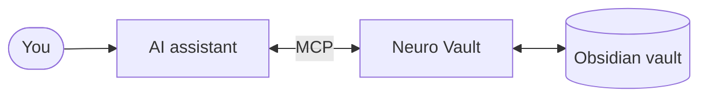

# Neuro Vault MCP

**Semantic vault search and direct vault operations for your Obsidian vault — right inside your AI assistant.**

[](https://www.npmjs.com/package/neuro-vault-mcp)
[](https://nodejs.org)
[](LICENSE)

> "What did I write about that idea last month?" — and now your assistant can actually answer.

---

## ✨ Why Neuro Vault?

- 🧠 **Semantic search over your existing vault** — reuses [Smart Connections](https://github.com/brianpetro/obsidian-smart-connections) embeddings already in your vault. No re-indexing, no API keys, no extra infrastructure.
- 🎯 **Mode-aware retrieval** — `quick` for direct lookups, `deep` for exploratory questions with block-level results and semantic expansion of related notes.
- ✍️ **Direct vault operations** — read, create, append, and prepend notes (including daily notes) straight from your AI assistant via the [Obsidian CLI](https://github.com/AlexMost/obsidian-cli).
- ⚡ **Zero infrastructure** — local stdio MCP server, in-memory index, no database, no background processes, no watchers.
- 🔌 **Drop-in for any MCP client** — Claude Code, Cursor, Windsurf — configuration is a single JSON block.

---

<details>
<summary><b>📦 Install & MCP client config</b></summary>

### Requirements

- Node.js 20+
- Obsidian vault with the [Smart Connections](https://github.com/brianpetro/obsidian-smart-connections) plugin (embeddings must be generated)
- Smart Connections data at `<vault>/.smart-env/multi/*.ajson`
- _For vault operations (optional):_ the [Obsidian CLI](https://github.com/AlexMost/obsidian-cli) on `PATH` and Obsidian running. Pass `--no-operations` to disable, or `--obsidian-cli /path` to point at a custom binary.

### 1. Install

```bash
npm install -g neuro-vault-mcp
```

### 2. Configure your MCP client

For Claude Code (`~/.claude/settings.json` or `.claude/settings.json` in your project):

```json
{
  "mcpServers": {
    "neuro-vault": {
      "command": "neuro-vault-mcp",
      "args": ["--vault", "/absolute/path/to/your/vault"]
    }
  }
}
```

For Cursor or Windsurf (`.cursor/mcp.json` / `.windsurf/mcp.json`):

```json
{
  "mcpServers": {
    "neuro-vault": {
      "command": "neuro-vault-mcp",
      "args": ["--vault", "/absolute/path/to/your/vault"]
    }
  }
}
```

Or run without installing using `npx`:

```json
{
  "mcpServers": {
    "neuro-vault": {
      "command": "npx",
      "args": ["-y", "neuro-vault-mcp", "--vault", "/absolute/path/to/your/vault"]
    }
  }
}
```

### 3. Try it

Ask your assistant:

> "What did I write about building AI agents?"
>
> "Find my notes on productivity systems"
>
> "What are all my ideas related to embeddings?"

On first run the embedding model downloads automatically (~40 MB). Subsequent starts are fast.

</details>

---

## 🔍 Semantic Search

Find notes by meaning, not by filename. The server embeds your query with `TaylorAI/bge-micro-v2`, runs cosine similarity against the Smart Connections corpus loaded into memory at startup, and returns ranked results with optional block-level matches and semantic expansion.

### Tools

#### `search_notes`

Search the vault by semantic similarity.

```typescript
search_notes({
  query: string,               // short keyword query (1-4 words)
  mode?: "quick" | "deep",     // default: "quick"
  threshold?: number,          // override mode default (0–1)
  expansion?: boolean,         // override mode default
  expansion_limit?: number,    // how many top results to expand (default: 3)
})
```

Returns `results` (ranked notes) and `blockResults` (ranked sections — scoped to matched notes in `quick` mode, all sources in `deep` mode).

#### `get_similar_notes`

Find notes similar to a given note path. Use this after `search_notes` finds a relevant note — it discovers related content without needing a text query.

```typescript
get_similar_notes({
  note_path: string,  // vault-relative POSIX path, e.g. "Projects/neuro-vault.md"
  limit?: number,     // default: 10
  threshold?: number, // default: 0.5
})
```

#### `find_duplicates`

Find note pairs with high embedding similarity. Useful for vault maintenance: identifies notes that cover the same topic and could be merged.

```typescript
find_duplicates({
  threshold?: number, // default: 0.9
})
```

#### `get_stats`

Report loaded corpus statistics. Returns `{ totalNotes, totalBlocks, embeddingDimension, modelKey }`.

### Behavior

Every search picks a mode that controls retrieval depth:

| Mode    | Use when                          | Limit | Threshold | Expansion |
| ------- | --------------------------------- | ----- | --------- | --------- |
| `quick` | Specific question, need 1-2 notes | 3     | 0.50      | off       |
| `deep`  | Broad topic, need an overview     | 8     | 0.35      | on        |

The AI assistant picks the mode automatically based on your question, or you can pass it explicitly.

- **Block-level results (deep mode)** — the server also searches by individual note sections, surfacing the exact paragraphs that match, not just the notes that contain them.
- **Expansion (deep mode)** — after finding top results, the server uses their embeddings to discover neighboring notes that don't directly match your query but are semantically close to what you found.
- **Automatic fallback** — when vector search returns nothing, the server retries with a lower similarity threshold (0.3). If still nothing, the assistant can fall back to its own file-search tools.

### Tips for better results

- Use short keyword queries (1–4 words), not full sentences.
- Call multiple times for synonyms and translations: `"embeddings"`, then `"векторний пошук"`, then `"vector search"`.
- Lower the threshold to `0.3` if nothing comes back.
- Use `deep` mode for exploratory questions.

---

## 🗂 Vault Operations

> Requires the [Obsidian CLI](https://github.com/AlexMost/obsidian-cli) on `PATH` and Obsidian running. Pass `--no-operations` to disable.

Read and write notes through Obsidian itself — the operations module shells out to the `obsidian` CLI, so changes are picked up by Smart Connections, sync, and any other plugin you have installed. No bypass of Obsidian's own state.

### Tools

#### `read_note`

Read a note's contents. Provide exactly one of `name` or `path`.

```typescript
read_note({
  name?: string,    // wikilink-style: "My Note"
  path?: string,    // vault-relative: "Folder/My Note.md"
})
```

Returns `{ path, content }`.

#### `create_note`

Create a new note. `overwrite: true` is destructive — the AI assistant will ask before passing it.

```typescript
create_note({
  name?: string,
  path?: string,
  content?: string,
  template?: string,
  overwrite?: boolean,
})
```

#### `edit_note`

Add content to an existing note.

```typescript
edit_note({
  name?: string,
  path?: string,
  content: string,
  position: 'append' | 'prepend',
})
```

#### `read_daily`

Read today's daily note. Returns `{ path, content }`.

#### `append_daily`

Append content to today's daily note.

```typescript
append_daily({ content: string });
```

---

## 🏗 How it works



You ask, the assistant calls Neuro Vault, Neuro Vault reads your vault — semantic search uses embeddings already in `.smart-env/`, vault operations go through the `obsidian` CLI. No database, no background processes.

For module wiring and internal data flow, see [docs/architecture/module-structure.md](./docs/architecture/module-structure.md).

---

<details>
<summary><b>🧭 Search routing guidance</b></summary>

Tool routing and retrieval policy are related, but not the same thing.

- Use **structural tools** first (your assistant's own file/path/title tools, or vault operations) for exact file, title, path, daily note, tag, property, wikilink, backlink, and link-traversal requests.
- Use `search_notes` for fuzzy topic, concept, and semantic retrieval.
- Use `get_similar_notes` after you already have a relevant note and want semantic expansion.
- Treat the routing guidance as behavior, not enforcement; the server does not hard-block other tool choices.
- Use semantic retrieval to find likely notes, then switch to structural tools when you need exact anchors.

</details>

<details>
<summary><b>⚙️ Configuration</b></summary>

### CLI Arguments

| Argument         | Required | Default    | Description                                             |
| ---------------- | -------- | ---------- | ------------------------------------------------------- |
| `--vault`        | yes      | —          | Absolute path to the Obsidian vault directory           |
| `--semantic`     | no       | `true`     | Enable semantic search module (`--no-semantic` to skip) |
| `--operations`   | no       | `true`     | Enable vault operations module (`--no-operations`)      |
| `--obsidian-cli` | no       | `obsidian` | Path to the `obsidian` CLI binary (override only)       |
| `--help`         | no       | —          | Show help                                               |

### Startup Behavior

- Smart Connections `.ajson` files are loaded into memory once at startup.
- The embedding model (`TaylorAI/bge-micro-v2`) is downloaded on first run and cached by `@xenova/transformers`.
- If the vault path is missing or Smart Connections data is absent, the server exits immediately with an error.

### AGENTS.md / CLAUDE.md snippet

Add this to your `AGENTS.md` or `CLAUDE.md` to help the AI assistant use the vault effectively:

```markdown
## Vault search

Use vault-aware tools when vault context matters.
Do not guess about note contents when the vault can be searched.
Follow the Neuro Vault MCP server instructions for routing between semantic search (`search_notes`, `get_similar_notes`) and operations (`read_note`, `create_note`, `edit_note`, `read_daily`, `append_daily`).
```

</details>

<details>
<summary><b>🩺 Troubleshooting</b></summary>

**"Smart Connections directory does not exist"** — make sure the Smart Connections plugin has run and generated embeddings. Open Obsidian, let Smart Connections finish indexing, then restart the MCP server.

**First startup is slow** — the embedding model (~40 MB) is downloading. Subsequent starts use the cached model.

**Search returns nothing** — try lowering the threshold: `threshold: 0.3`. Also check that `get_stats` shows a non-zero `totalNotes`.

**Vault operations fail with `CLI_NOT_FOUND` / `CLI_UNAVAILABLE`** — the `obsidian` CLI isn't on `PATH`, or Obsidian isn't running. Install the [Obsidian CLI](https://github.com/AlexMost/obsidian-cli), or pass `--obsidian-cli /absolute/path/to/obsidian`. Disable the module with `--no-operations` if you only want semantic search.

</details>

<details>
<summary><b>🛠 Development</b></summary>

```bash
npm run build        # compile TypeScript to dist/
npm run test         # run tests with vitest
npm run lint         # ESLint
npm run format       # check formatting with Prettier
npm run format:write # fix formatting
```

</details>

<details>
<summary><b>🚧 Limitations</b></summary>

- Requires Smart Connections `.ajson` files already present in the vault.
- In-memory search only — no persistent index, no background re-indexing.
- stdio transport only — not HTTP or SSE.
- Local vault path only — no remote vaults.
- Embedding model loaded at startup; first run can be slow.
- Operations tools require the Obsidian CLI and a running Obsidian instance — they fail gracefully per call when unavailable.

</details>

---

## 📄 License

ISC — see [LICENSE](LICENSE).

Changelog: [Releases](https://github.com/AlexMost/neuro-vault/releases)
