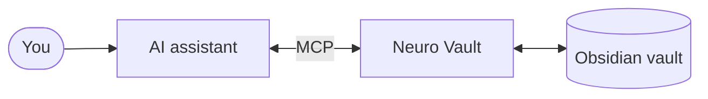

# Neuro Vault MCP

> 🧠💾 **Make your personal vault usable by agents.** Low-token retrieval, explicit provenance, and safe writes for your Obsidian notes — in Claude Code, Cursor, Windsurf, and any MCP client.

[https://github.com/user-attachments/assets/25c1bafb-7b90-43ac-aa50-50e85705fb5b](https://github.com/user-attachments/assets/5ac86cd7-2d67-420d-b940-dba4ae1a2ccb)

[](https://www.npmjs.com/package/neuro-vault-mcp)
[](https://nodejs.org)
[](LICENSE)

Your second brain stops being a folder you open between contexts and becomes a first-class participant in every project. Agents can recall the right notes, inspect the evidence, and write back through vault-aware operations — without grepping the whole folder or flooding the context window.

> _"What did I write about that idea last month?"_ — and now your assistant can actually answer.

---

## ✨ Why Neuro Vault?

- 🧠 **Hybrid search that already knows your vault** — a semantic leg reuses [Smart Connections](https://github.com/brianpetro/obsidian-smart-connections) embeddings (no re-indexing, no API keys), and a lexical leg catches exact names, codes, and terms embeddings miss. One call, both answers; a note hit by both is the strongest relevance signal.
- 🎯 **Quick or deep, your call** — `effort: "quick"` for fast direct lookups, `effort: "deep"` for exploration with related-note expansion; `mode: "lexical"` when you want exact text matching only (works even without embeddings).
- 🧾 **Context with provenance, not mystery memory** — results come back with paths, matched queries, block-level snippets, and backlink counts so the assistant can show where an answer came from.
- 🧭 **A real navigation toolkit for your agent** — instead of grepping files and opening notes one by one, your assistant walks the vault like a database: filter by tags and properties, batch-read metadata, traverse the wikilink graph, discover the structure, jump to semantic neighbours.
- 🔎 **Ask structured questions in plain language** — _"active projects tagged #ai"_, _"todo tasks with a deadline this week"_, _"meeting notes from `Work/` newest first"_ — one call, ranked answer, no chains of reads.
- ✍️ **Full write surface for your notes** — create, in-place replace, or rewrite the whole body; manage frontmatter, tags, and daily notes. Frontmatter and creation route through the [Obsidian CLI](https://github.com/AlexMost/obsidian-cli) so Smart Connections, sync, and other plugins stay in the loop; in-place edits write directly to disk and the watcher catches up.
- ⚡ **Zero infrastructure** — local stdio MCP server, in-memory index, no database, no background processes, no watchers.
- 🔌 **Drop-in for any MCP client** — Claude Code, Cursor, Windsurf — configuration is a single JSON block.

---

## 🧰 Two superpowers, one server

Most "vault MCP" servers give you one or the other. Neuro Vault gives you both, and lets your assistant pick the right one per question:

|                  | 🔭 **Hybrid recall**                                                                                                              | 🛠 **Vault operations**                                                                                      |
| ---------------- | ---------------------------------------------------------------------------------------------------------------------------------- | ------------------------------------------------------------------------------------------------------------ |
| **What it does** | Finds notes by meaning _and_ by exact wording — semantic + lexical legs in one response. Surfaces neighbours and duplicates.       | Reads, writes, edits notes (in-place replace and full-body rewrite); manages frontmatter, tags, daily notes. |
| **Best for**     | _"What did I think about X?"_, fuzzy recall, exploratory research — and exact names, codes, terms the embeddings don't know.      | Structured queries, capturing decisions, updating tasks, batch reads.                                        |
| **Powered by**   | Smart Connections embeddings (already in your vault) + direct text matching over titles, headings, and bodies (no index needed). | The official Obsidian CLI — Smart Connections, sync, plugins all stay in sync.                               |

The two work together: hybrid search finds the right region of the vault, vault operations let the assistant actually _do something_ with what it found.

---

## ✨ What it looks like in practice

**Before:** _"Could you check my notes about that LangGraph experiment?"_
→ Assistant lists `Notes/`, opens 12 files, greps for "LangGraph", gives up halfway, you paste the relevant note manually.

**After:** _"Could you check my notes about that LangGraph experiment?"_
→ One hybrid search — semantic matches plus exact "LangGraph" hits in the same response — follow-up question already grounded in your own writing.

A few more questions Neuro Vault makes one-shot:

> _"What are my active projects tagged #ai with a deadline this quarter?"_
> _"Show meeting notes from `Work/` from the last two weeks, newest first."_
> _"Find notes similar to this one I'm reading."_
> _"Append today's decision to the daily note."_
> _"What's on my agenda today — and what did I capture in other notes since this morning?"_
> _"What did past-me write about retrieval policy before I started building it?"_

One question, one answer. Your assistant stops being a file browser and starts being an actual second brain.

→ See [docs/guide/finding-notes.md](./docs/guide/finding-notes.md#query_notes) for the full query language and examples.

---

### 🔍 Pre-filter: scope search with structural filters

`search_notes` accepts an optional `filter` to narrow the candidate set **before** ranking — combining the precision of `query_notes` with the recall of hybrid search. The filter applies identically to both legs: only notes that pass it can appear in `semantic_matches` or `lexical_matches`. Useful when domain-relevant notes are crowded out by larger narrative clusters.

```json
{ "query": "trading lessons", "filter": { "tags": ["trading"] } }
```

`filter` accepts `path_prefix` (string or array), `exclude_path_prefix` (string or array — drops matched subtrees), `tags` (ANY-of), and a `frontmatter` sift filter. Composition is include → exclude → tags → frontmatter, then each leg ranks within the allowed set (`threshold` further cuts the semantic leg only). See the [Finding Notes guide](./docs/guide/finding-notes.md#pre-filter-filter-parameter) for full details.

---

## 🏗 How it works



You ask, the assistant calls Neuro Vault, Neuro Vault reads your vault — the semantic leg uses embeddings already in `.smart-env/`, the lexical leg reads notes straight from disk, vault operations go through the `obsidian` CLI. No database, no background processes.

For module wiring and internal data flow, see [docs/architecture/module-structure.md](./docs/architecture/module-structure.md).

---

## ⚡ Quickstart

```bash
npm install -g neuro-vault-mcp
```

### Single vault

Add to your MCP client config (here: Claude Code's `~/.claude/settings.json`):

```json
{
  "mcpServers": {
    "neuro-vault": {
      "command": "neuro-vault-mcp",
      "args": ["--vault", "/absolute/path/to/your/vault"]
    }
  }
}
```

> **Vault directory names** must match `^[a-zA-Z0-9_-]{1,64}$` — ASCII letters, digits, `_`, or `-`; 1–64 chars. Spaces and Unicode are rejected. The MCP-side alias is the directory basename, so if Obsidian shows the vault as "My Vault", the directory itself must be `My_Vault` or similar.

### 🗂 Multi-vault — two vaults, one server

Pass `--vault` once per vault:

```bash
neuro-vault-mcp \
  --vault /Users/me/Vaults/Sandbox \
  --vault /Users/me/Vaults/TeamWiki
```

Two vaults registered, with names `Sandbox` and `TeamWiki`. In your MCP config:

```json
{
  "mcpServers": {
    "neuro-vault": {
      "command": "neuro-vault-mcp",
      "args": ["--vault", "/Users/me/Vaults/Sandbox", "--vault", "/Users/me/Vaults/TeamWiki"]
    }
  }
}
```

Two vaults cannot share the same directory basename — the basename doubles as the alias and must be unique. If you have a basename collision, rename one of the directories.

With multiple vaults registered:

- **Every tool** accepts an optional `vault: "<name>"` parameter to target a specific vault.
- **`search_notes`, `query_notes`, `get_vault_overview`, `list_tags`, and `list_properties`** fan out across all registered vaults when `vault` is omitted. The response shape switches to `results_by_vault: [...]` (one entry per vault) plus `skipped_vaults: [...]` for any vault the tool could not reach and `failed_vaults: [...]` for per-vault runtime errors (`{ vault, error: { code, message, details? } }`). A single failed vault does not abort the whole call.
- **All other tools** (writes, reads of specific paths, single-vault diagnostics) require an explicit `vault` in multi-vault mode. Omitting it returns `VAULT_REQUIRED`.
- **A vault without a Smart Connections `.smart-env/multi/` index still participates** in `search_notes` fan-out — it contributes `lexical_matches` with an empty `semantic_matches`; no vault is skipped. Targeting such a vault explicitly with the embeddings-only tools (`get_similar_notes`, `find_duplicates`) returns `SEMANTIC_INDEX_NOT_FOUND`.

Then ask your assistant:

> "What did I write about building AI agents?"

On first run the embedding model downloads automatically (~40 MB). Subsequent starts are fast.

For other clients (Cursor / Windsurf / npx), see [docs/guide/installation.md](./docs/guide/installation.md).

---

## 📚 Documentation

> **Every tool accepts an optional `vault` parameter.** In multi-vault mode, `search_notes`, `query_notes`, and `get_vault_overview` fan out across all registered vaults when `vault` is omitted.

User guide lives in [`docs/guide/`](./docs/guide/README.md):

- [Installation](./docs/guide/installation.md)
- [Finding Notes](./docs/guide/finding-notes.md) — `search_notes` (hybrid semantic + lexical), structured queries (`query_notes`), `get_similar_notes`, `find_duplicates`, `get_note_links`
- [Reading & Modifying](./docs/guide/reading-and-modifying.md) — note CRUD, daily notes, properties, tags, vault snapshot (`get_vault_overview`)
- [Routing Between Tools](./docs/guide/routing.md)
- [Configuration](./docs/guide/configuration.md) — CLI args, troubleshooting, limitations, development

Architecture / internals: [`docs/architecture/`](./docs/architecture/).

---

### Vault-specific conventions for external agents

When the server starts, it looks for `<vault>/.neuro-vault/for-external-agents.md`. If the file exists, its content is appended to the MCP `instructions` that clients receive at `initialize`, under a `## Vault-specific conventions` section. Use this file to teach external agents vault-specific rules that cannot be derived from the snapshot — for example, closed sets of frontmatter `type` values, or folders that are off-limits for writes. The file is optional; without it the server still ships sane defaults plus a pointer to `get_vault_overview`.

---

## 📄 License

ISC — see [LICENSE](LICENSE).

Changelog: [Releases](https://github.com/AlexMost/neuro-vault/releases)
