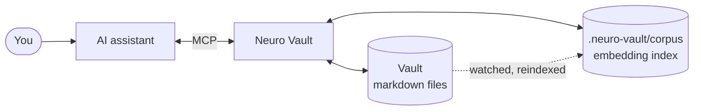

# Neuro Vault MCP

> 🧠💾 **Make your personal vault usable by agents.** Low-token retrieval, explicit provenance, and safe writes for your Obsidian notes — in Claude Code, Cursor, Windsurf, and any MCP client.

[https://github.com/user-attachments/assets/3f27fc94-36d3-44bb-aec5-35f6ce941bc2](https://github.com/user-attachments/assets/3f27fc94-36d3-44bb-aec5-35f6ce941bc2)

[](https://www.npmjs.com/package/neuro-vault-mcp)
[](https://nodejs.org)
[](LICENSE)
[](./CHANGELOG.md)

Your second brain stops being a folder you open between contexts and becomes a first-class participant in every project. Agents can recall the right notes, inspect the evidence, and write back through vault-aware operations — without grepping the whole folder or flooding the context window.

> _"What did I write about that idea last month?"_ — and now your assistant can actually answer.

---

## ✨ Why Neuro Vault?

- 🧠 **Hybrid search that already knows your vault** — a semantic leg runs on an embedding index the server builds and owns from your notes (no plugin, no API keys — the first run indexes in the background), and a lexical leg catches exact names, codes, and terms embeddings miss. One call, both answers; a note hit by both is the strongest relevance signal.
- 🎯 **Quick or deep, your call** — `effort: "quick"` for fast direct lookups, `effort: "deep"` for exploration with related-note expansion; `mode: "lexical"` when you want exact text matching only (works even without embeddings).
- 🧾 **Context with provenance, not mystery memory** — results come back with paths, matched queries, block-level snippets, and backlink counts so the assistant can show where an answer came from.
- 🧭 **A real navigation toolkit for your agent** — instead of grepping files and opening notes one by one, your assistant walks the vault like a database: filter by tags and properties, batch-read metadata, traverse the wikilink graph, discover the structure, jump to semantic neighbours.
- 🔎 **Ask structured questions in plain language** — _"active projects tagged #ai"_, _"todo tasks with a deadline this week"_, _"meeting notes from `Work/` newest first"_. Your assistant turns them into a **MongoDB-style filter** over frontmatter, tags, and backlink counts — one call, ranked answer, no chains of reads.
- ✍️ **Full write surface for your notes** — create, in-place replace, or rewrite the whole body; manage frontmatter, tags, and daily notes. Every write goes directly to disk; if you have Obsidian open, its own file watcher picks up the change on its usual cadence.
- ⚡ **Zero infrastructure** — local stdio MCP server, no database, no external processes, no API keys. The server keeps its own index fresh with an in-process watcher — nothing to run, nothing to babysit.
- 🪶 **Obsidian optional** — a vault is just a directory of Markdown files, and the server reads and writes it headlessly: no plugin, no running app, nothing to install beyond this server. Obsidian-flavoured conventions (`[[wikilinks]]`, YAML frontmatter, inline `#tags`) are understood wherever they appear. The one tool that genuinely wants Obsidian is `read_daily` — it reads the Daily Notes plugin's `.obsidian/daily-notes.json` to learn your folder and date format, and returns `DAILY_NOTES_NOT_CONFIGURED` without it.
- 🔌 **Drop-in for any MCP client** — Claude Code, Cursor, Windsurf — configuration is a single JSON block.

---

## 🧰 Two superpowers, one server

Most "vault MCP" servers give you one or the other. Neuro Vault gives you both, and lets your assistant pick the right one per question:

|                  | 🔭 **Hybrid recall**                                                                                                              | 🛠 **Vault operations**                                                                                      |
| ---------------- | ---------------------------------------------------------------------------------------------------------------------------------- | ------------------------------------------------------------------------------------------------------------ |
| **What it does** | Finds notes by meaning _and_ by exact wording — semantic + lexical legs in one response. Surfaces neighbours and duplicates.       | Reads, writes, edits notes (in-place replace and full-body rewrite); manages frontmatter, tags, daily notes. |
| **Best for**     | _"What did I think about X?"_, fuzzy recall, exploratory research — and exact names, codes, terms the embeddings don't know.      | Structured queries, capturing decisions, updating tasks, batch reads.                                        |
| **Powered by**   | Embeddings the server builds and owns from your vault + direct text matching over titles, headings, and bodies. | Direct reads and writes against the vault directory on disk — no Obsidian install or running instance needed. |

The two work together: hybrid search finds the right region of the vault, vault operations let the assistant actually _do something_ with what it found.

---

## ✨ What it looks like in practice

**Before:** _"Could you check my notes about that LangGraph experiment?"_
→ Assistant lists `Notes/`, opens 12 files, greps for "LangGraph", gives up halfway, you paste the relevant note manually.

**After:** _"Could you check my notes about that LangGraph experiment?"_
→ One hybrid search — semantic matches plus exact "LangGraph" hits in the same response — follow-up question already grounded in your own writing.

A few more questions Neuro Vault makes one-shot:

> _"What are my active projects tagged #ai with a deadline this quarter?"_
> _"Show meeting notes from `Work/` from the last two weeks, newest first."_
> _"Find notes similar to this one I'm reading."_
> _"Append today's decision to the daily note."_
> _"What's on my agenda today — and what did I capture in other notes since this morning?"_
> _"What did past-me write about retrieval policy before I started building it?"_

One question, one answer. Your assistant stops being a file browser and starts being an actual second brain.

---

### 🔭 One search, both legs

`search_notes` is the flagship: **one call runs a semantic leg and a lexical leg and fuses them into a single ranked list.** No picking a strategy up front, no cross-referencing two result sets by hand.

Pass up to eight queries at once — synonyms, jargon, translations. The semantic leg works across languages, so a note written in one language is found by a query in another:

```json
{ "query": ["retrieval policy", "політика пошуку", "RRF"], "effort": "deep" }
```

Each match comes back with **its own provenance and evidence** — not just a path and a score:

```json
{
  "path": "Notes/embeddings.md",
  "found_in": ["semantic", "lexical:title"],
  "similarity": 0.82,
  "blocks": [{ "heading": "Notes/embeddings.md#What is an embedding", "lines": [3, 20] }],
  "lexical": [{ "matched_in": "title", "snippet": "embeddings" }],
  "backlink_count": 4
}
```

`found_in` names every leg that surfaced the note — here both of them, which is the strongest relevance signal the server can give you. `blocks[]` points at the specific section and line range that matched, so the assistant can pull twenty lines instead of the whole note: that is where the low-token part of "low-token retrieval" actually comes from.

**Fusion is the point.** A note found by two legs is lifted in the merged order automatically (reciprocal rank fusion) and still appears exactly once — there is no caller-side merging to write, and no way to double-count a note that both legs liked.

**It degrades instead of failing.** While the embedding index is still building — or if you turned semantic off entirely — `search_notes` keeps answering from its lexical leg alone and reports `semantic_status` so the assistant knows which legs actually ran. Add `mode: "lexical"` to ask for exact text matching only, and `effort: "quick" | "deep"` to trade breadth for speed.

→ Full reference: [docs/guide/finding-notes.md#search_notes](./docs/guide/finding-notes.md#search_notes)

---

### 🔍 Pre-filter: scope search with structural filters

`search_notes` accepts an optional `filter` to narrow the candidate set **before** ranking — combining the precision of `query_notes` with the recall of hybrid search. The filter applies identically to every leg: only notes that pass it can appear in the fused `matches[]` list. Useful when domain-relevant notes are crowded out by larger narrative clusters.

```json
{ "query": "trading lessons", "filter": { "tags": ["trading"] } }
```

`filter` accepts `path_prefix` (string or array), `exclude_path_prefix` (string or array — drops matched subtrees), `tags` (ANY-of), and a `frontmatter` sift filter. Composition is include → exclude → tags → frontmatter, then each leg ranks within the allowed set (`threshold` further cuts the semantic leg only). See the [Finding Notes guide](./docs/guide/finding-notes.md#pre-filter-filter-parameter) for full details.

---

### 🗃 Query your vault like a database

`query_notes` runs a **MongoDB-style filter** over every note's frontmatter, tags, path, and backlink count. It's syntax your assistant already knows from training data — nothing to teach it — and it collapses N+1 patterns like _"list tags → read each note → filter in my head"_ into a single call.

```json
{
  "filter": {
    "$and": [
      { "tags": "ai" },
      { "$or": [{ "frontmatter.status": "active" }, { "frontmatter.status": "wip" }] },
      { "frontmatter.deadline": { "$exists": true } }
    ]
  },
  "path_prefix": "Projects/",
  "sort": { "field": "frontmatter.deadline", "order": "asc" }
}
```

Operators: `$eq` `$ne` `$in` `$nin` `$gt` `$gte` `$lt` `$lte` `$exists` `$regex` `$and` `$or` `$nor` `$not`. They run through [sift](https://github.com/crcn/sift.js) behind a strict allow-list — `$where` and `$function` are rejected, so a filter can never become code execution on your machine. Notes are scanned in bounded batches with an early exit, so _"the first 100 active projects"_ stops reading the moment it has them.

→ Full filter reference: [docs/guide/finding-notes.md#query_notes](./docs/guide/finding-notes.md#query_notes)

---

## 🏗 How it works


```mermaid
flowchart LR
    You([You]) --> AI[AI assistant]
    AI <-->|MCP| NV[Neuro Vault]
    NV <--> Vault[("Vault<br/>markdown files")]
    NV <--> Corpus[(".neuro-vault/corpus<br/>embedding index")]
    Vault -.->|watched, reindexed| Corpus
```

You ask, the assistant calls Neuro Vault, Neuro Vault reads your vault — the semantic leg ranks against an embedding index the server builds and keeps in `<vault>/.neuro-vault/corpus/`, the lexical leg reads notes straight from disk, and vault operations read and write the vault directory directly on disk too. No database, no external process, no Obsidian install required — an in-process watcher reconciles the index after ~10 seconds of quiet, so it never falls far behind what's on disk.

For module wiring and internal data flow, see [docs/architecture/module-structure.md](./docs/architecture/module-structure.md).

---

## ⚡ Quickstart

```bash
npm install -g neuro-vault-mcp
```

### Single vault

Add to your MCP client config (here: Claude Code's `~/.claude/settings.json`):

```json
{
  "mcpServers": {
    "neuro-vault": {
      "command": "neuro-vault-mcp",
      "args": ["--vault", "/absolute/path/to/your/vault"]
    }
  }
}
```

> **Vault directory names** must match `^[a-zA-Z0-9_-]{1,64}$` — ASCII letters, digits, `_`, or `-`; 1–64 chars. Spaces and Unicode are rejected. The MCP-side alias is the directory basename, so a vault you think of as "My Vault" — the name Obsidian would display, for instance — must live in a directory called `My_Vault` or similar.

### 🗂 Multi-vault — two vaults, one server

Pass `--vault` once per vault:

```bash
neuro-vault-mcp \
  --vault /Users/me/Vaults/Sandbox \
  --vault /Users/me/Vaults/TeamWiki
```

Two vaults registered, with names `Sandbox` and `TeamWiki`. In your MCP config:

```json
{
  "mcpServers": {
    "neuro-vault": {
      "command": "neuro-vault-mcp",
      "args": ["--vault", "/Users/me/Vaults/Sandbox", "--vault", "/Users/me/Vaults/TeamWiki"]
    }
  }
}
```

Two vaults cannot share the same directory basename — the basename doubles as the alias and must be unique. If you have a basename collision, rename one of the directories.

With multiple vaults registered:

- **Every tool** accepts an optional `vault: "<name>"` parameter to target a specific vault.
- **`search_notes`, `query_notes`, `get_vault_overview`, `list_tags`, and `list_properties`** fan out across all registered vaults when `vault` is omitted. The response shape switches to `results_by_vault: [...]` (one entry per vault) plus `failed_vaults: [...]` for per-vault runtime errors (`{ vault, error: { code, message, details? } }`) — a single failed vault does not abort the whole call. The envelope also always includes `skipped_vaults: [...]`, reserved for a future fan-out tool that pre-filters vaults; today it's always empty, since nothing skips a vault.
- **All other tools** (writes, reads of specific paths, single-vault diagnostics) require an explicit `vault` in multi-vault mode. Omitting it returns `VAULT_REQUIRED`.
- **A vault whose semantic index is still building (or disabled) still participates** in `search_notes` fan-out — it contributes `matches[]` fused from its lexical leg alone and reports `semantic_status` so the caller knows why; no vault is skipped. Targeting such a vault explicitly with the embeddings-only tools (`get_similar_notes`, `find_duplicates`) returns `SEMANTIC_INDEX_BUILDING` while indexing, `SEMANTIC_DISABLED` if the vault opted out, or `SEMANTIC_INDEX_NOT_FOUND` if the index is genuinely unavailable.

Then ask your assistant:

> "What did I write about building AI agents?"

On first run the embedding model downloads automatically (~40 MB). Subsequent starts are fast.

Indexing then runs in the background — the server boots immediately and `search_notes` answers from its lexical leg until the first pass finishes. To warm the index up front instead (before a demo, or for a large vault):

```bash
neuro-vault-mcp index --vault /absolute/path/to/your/vault
```

For other clients (Cursor / Windsurf / npx), see [docs/guide/installation.md](./docs/guide/installation.md).

---

## 📚 Documentation

> **Every tool accepts an optional `vault` parameter.** In multi-vault mode, `search_notes`, `query_notes`, `get_vault_overview`, `list_tags`, and `list_properties` fan out across all registered vaults when `vault` is omitted.

User guide lives in [`docs/guide/`](./docs/guide/README.md):

- [Installation](./docs/guide/installation.md)
- [Finding Notes](./docs/guide/finding-notes.md) — `search_notes` (hybrid semantic + lexical), structured queries (`query_notes`), `get_similar_notes`, `find_duplicates`, `get_note_links`
- [Reading & Modifying](./docs/guide/reading-and-modifying.md) — note CRUD, daily notes, properties, tags, vault snapshot (`get_vault_overview`)
- [Routing Between Tools](./docs/guide/routing.md)
- [Configuration](./docs/guide/configuration.md) — CLI args, vault conventions for external agents, troubleshooting, limitations, development

Architecture / internals: [`docs/architecture/`](./docs/architecture/).

📝 What changed between versions — including every `⚠ BREAKING CHANGES` block — lives in [`CHANGELOG.md`](./CHANGELOG.md) (shipped inside the npm package too). The same notes are published per version on [GitHub Releases](https://github.com/AlexMost/neuro-vault/releases).

---

### Vault-specific conventions for external agents

Drop a `<vault>/.neuro-vault/for-external-agents.md` into your vault to teach external agents the rules that cannot be derived from a structural snapshot — closed sets of frontmatter `type` values, folders that are off-limits for writes, how you scope notes to a project. The file is optional; without it the server still ships sane defaults plus a pointer to `get_vault_overview`.

It is delivered one way:

- 📦 **In every `get_vault_overview` response**, as a `conventions` field — and in the `vault://overview` resource (`vault://<vault-name>/overview` when several vaults are registered). It is read at call time (so edits take effect on the next call, **no server restart**), it reaches sub-agents, and no client we have measured truncates it. The field is simply absent when you have no such file. The MCP `instructions` string carries only a pointer telling the agent to make that call — never a copy of your file ([ADR-0012](./docs/adr/0012-conventions-leave-the-instructions-channel.md)).

Keep the file under **8,000 characters**. Past that the `conventions` field carries a trimmed slice and sets `conventions_truncated: true` — you never lose the call, but you do lose the tail, so compact rules beat exhaustive ones.

With several vaults registered, each one carries its own file: every entry in a fanned-out `results_by_vault` gets its own vault's `conventions`.

---

### 🙈 Keeping folders out of search

Note discovery — the lexical leg of `search_notes`, `query_notes`, tag/property listings, `get_vault_overview` counts, backlinks, note-name resolution — skips dot-directories, `Templates/`, and every entry in the vault root's `.gitignore`. `read_notes` by explicit path still reads them.

To exclude more, drop a `<vault>/.neuro-vault/config.json` with `{ "exclusions": ["Archive/**"] }`. Full rules, including the `.gitignore` subset that is honoured: [Configuration → Excluding paths from discovery](./docs/guide/configuration.md#excluding-paths-from-discovery).

---

## 📄 License

ISC — see [LICENSE](LICENSE).

Changelog: [CHANGELOG.md](./CHANGELOG.md) · [GitHub Releases](https://github.com/AlexMost/neuro-vault/releases)
