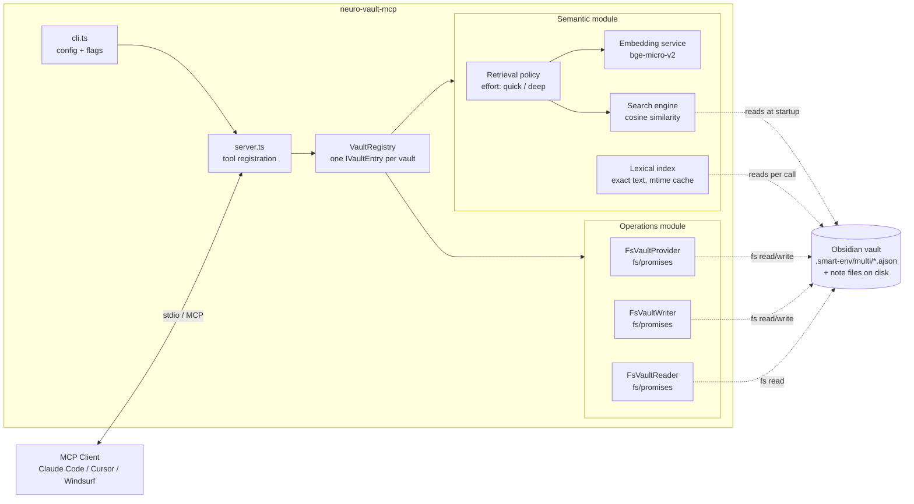

# Module Structure

How the server is split into pluggable modules and how they are wired together at startup.

## What it is

The codebase is organized into two modules under `src/modules/`:

- `semantic/` — search and similarity over the vault — 3 tools. Hosts hybrid `search_notes` (a semantic leg over a Smart Connections corpus via in-memory cosine search, plus a lexical leg via `src/lib/obsidian/lexical/` that reads notes from disk and needs no embeddings — see [`lexical-search.md`](./lexical-search.md)), `get_similar_notes`, and `find_duplicates`
- `operations/` — direct vault operations — 10 tools, grouped as note body (`read_notes`, `create_note`, `edit_note`, `read_daily`), structured queries (`query_notes`), frontmatter properties (`set_property`, `remove_property`), tags (`list_tags`), and vault overview (`get_vault_overview`)

Each module exports `createXModule(config, deps) → { tools: ToolRegistration[], resources: ResourceRegistration[], warmup? }`. `src/server.ts` aggregates registrations from enabled modules and registers them with the underlying `McpServer`. Modules also expose `resources: ResourceRegistration[]`. Operations exposes one — `vault://overview`, a JSON snapshot of vault structure backed by the same `computeVaultOverview` function that powers the `get_vault_overview` tool. Semantic exposes no resources today. A module with no resources returns an empty array.

## Why it exists

Different users want different things. Some have Smart Connections set up and want semantic search; some just want vault operations from their AI assistant; some want both. Splitting along this axis means:

- Users can disable the semantic module (`--no-semantic`) to avoid the startup cost of the embedding-model load and corpus parse. Note this unregisters `search_notes` entirely — including its lexical leg, even though that leg does not need embeddings. Operations tools are always registered — they are pure-object factories with no startup cost and no external runtime dependency.
- Each module is independently testable and reasonable in isolation.
- Adding a third module later (e.g. structural search) is a localized change — the server-level wiring is uniform.

## Boundaries

- A module exposes only `tools` (and an optional `warmup`). Anything else is internal.
- Modules do not call each other. If two modules ever need to share data, that data should live in `src/lib/` and both consume it from there.
- Module-specific types live inside the module (`modules/<name>/types.ts`). `src/types.ts` only contains the shared `ServerConfig`.

## Wiring

```
parseConfig(argv) → ServerConfig
   │
   ▼
VaultRegistry.create(config, deps) → VaultRegistry
   │  (one IVaultEntry per --vault name:path; per-vault corpus errors
   │   are caught and stored as semanticAvailable:false, not thrown)
   ▼
startNeuroVaultServer(config, deps)
   │
   ├─ if config.semantic.enabled  → createSemanticModule(registry, ...)  → registrations[]
   ├─ createOperationsModule(registry, ...) → registrations[]   (always)
   │
   └─ register all → server.connect(transport) → warmup
```

Both module factories receive the whole `VaultRegistry` rather than individual vault configs. Tool handlers reach into the registry at call time — either targeting a named vault (`registry.require(name)`) or fanning out across all vaults (`registry.list()`). See [`vault-registry.md`](./vault-registry.md) for details.

Operations tools are always registered — their construction is a zero-cost pure-object factory with no warmup or initialization. Errors surface at tool-call time (a missing note, an unwritable path, an unconfigured Daily Notes plugin), never at startup.

## End-to-end shape



The `VaultRegistry` is built once at startup from the list of vaults declared via `--vault` flags (repeatable). Each entry bundles a reader, writer, provider, wikilink graph, and — when the vault's `.smart-env/multi/` is loadable — a corpus index. When a vault's corpus cannot be loaded (missing directory, empty index, parse error), the entry's `semanticAvailable` field is `false` and the reason is recorded as a string; startup does not fail. The failure surfaces at semantic-tool-call time.

The semantic module loads `.smart-env/multi/*.ajson` into memory once at startup and keeps it there; the lexical leg of `search_notes` instead reads note files from disk at call time behind an mtime cache. The operations module reads and writes the vault directory directly — `FsVaultReader` for batch reads (`read_notes`, `query_notes`), `FsVaultWriter` for in-place edits (`edit_note`), and `FsVaultProvider` for everything else (`create_note`, `read_daily`, properties, tags) — with no external process anywhere in the path (see [ADR-0009](../adr/0009-disk-direct-vault-operations.md)). The semantic module can be disabled via `--no-semantic`; operations tools are always registered.
