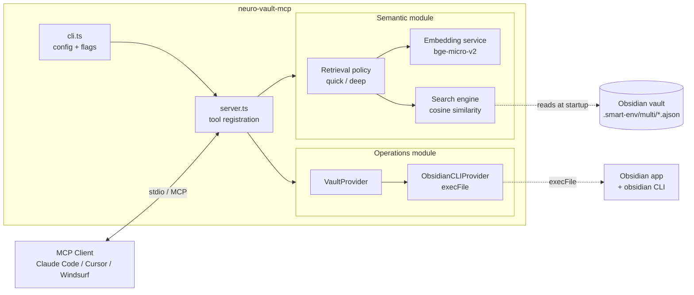

# Module Structure

How the server is split into pluggable modules and how they are wired together at startup.

## What it is

The codebase is organized into two modules under `src/modules/`:

- `semantic/` — embedding-based search over a Smart Connections corpus (in-memory cosine search) — 4 tools
- `operations/` — direct vault operations via the Obsidian CLI — 11 tools, grouped as note body (`read_note`, `create_note`, `edit_note`, `read_daily`, `append_daily`), frontmatter properties (`set_property`, `read_property`, `remove_property`, `list_properties`), and tags (`list_tags`, `get_tag`)

Each module exports `createXModule(config, deps) → { tools: ToolRegistration[], warmup? }`. `src/server.ts` aggregates registrations from enabled modules and registers them with the underlying `McpServer`.

## Why it exists

Different users want different things. Some have Smart Connections set up and want semantic search; some just want vault operations from their AI assistant; some want both. Splitting along this axis means:

- Users can disable a module they do not need (`--no-semantic` / `--no-operations`) and avoid its startup cost (e.g. embedding model download).
- Each module is independently testable and reasonable in isolation.
- Adding a third module later (e.g. structural search) is a localized change — the server-level wiring is uniform.

## Boundaries

- A module exposes only `tools` (and an optional `warmup`). Anything else is internal.
- Modules do not call each other. If two modules ever need to share data, that data should live in `src/lib/` and both consume it from there.
- Module-specific types live inside the module (`modules/<name>/types.ts`). `src/types.ts` only contains the shared `ServerConfig`.

## Wiring

```
parseConfig(argv) → ServerConfig
   │
   ▼
startNeuroVaultServer(config, deps)
   │
   ├─ if config.semantic.enabled  → createSemanticModule(...)  → registrations[]
   ├─ if config.operations.enabled → createOperationsModule(...) → registrations[]
   │
   └─ register all → server.connect(transport) → warmup
```

If both modules are disabled, startup fails fast with a clear error.

## End-to-end shape



The semantic module loads `.smart-env/multi/*.ajson` into memory once at startup and keeps it there. The operations module is a thin wrapper around the `obsidian` CLI invoked via `execFile`. Both modules can be enabled or disabled independently with `--semantic` / `--operations` flags.
